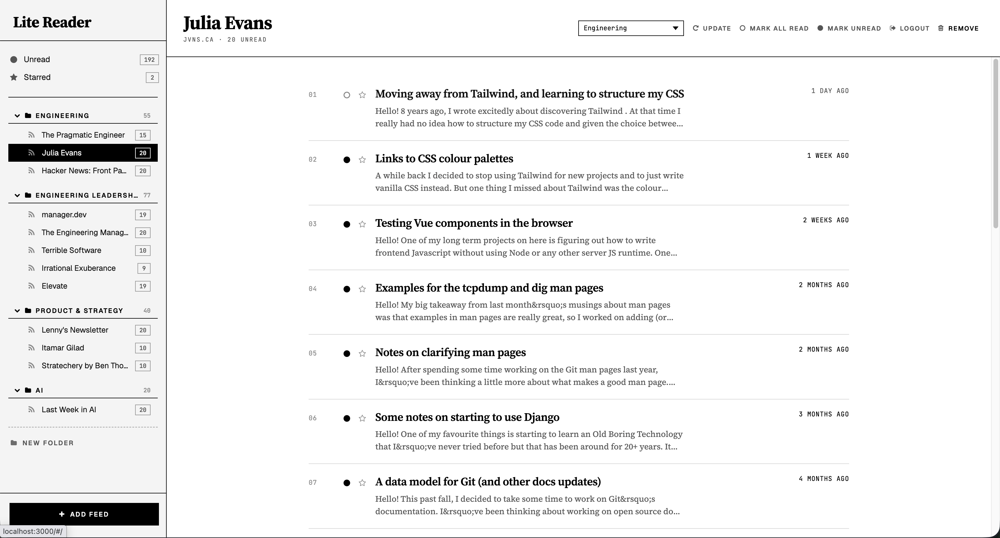
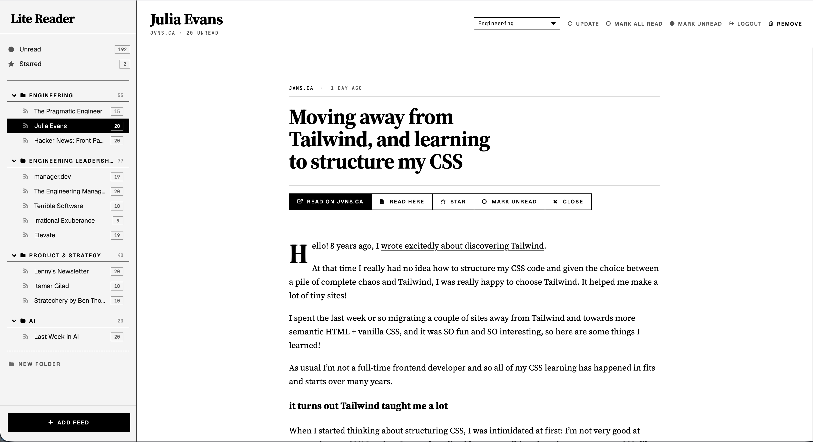

# Lite Reader

Read your feeds on your own machine with a simple and lite application.





## Table of Contents
- [Features](#features)
- [Requirements](#requirements)
- [Installation](#installation)
- [Usage](#usage)
- [Testing](#testing)
- [Migration from Legacy Lite Reader](#migration-from-legacy-lite-reader)
- [Contributing](#contributing)
- [License](#license)
- [Contact](#contact)

## Features
- Lightweight and minimal feed aggregator
- Easy to install and use
- Supports data migration from legacy Lite Reader
- **New:** Multi-user support with individual user feeds
- Feed management: add, update, delete feeds
- Item management: read, star, mark as read/unread

## Requirements
- None, just download the binary from the releases page and run it.

## Installation
1. Download the latest release from the [releases page](https://github.com/cubny/lite-reader/releases).
2. Run the binary:
   ```sh
   ./lite-reader
   ```
   By default the SQLite database is stored in your OS user config directory (see [Usage](#usage)). To store it somewhere else, set `DB_PATH` to an absolute path:
   ```sh
   DB_PATH=/var/lib/lite-reader/agg.db ./lite-reader
   ```

## Usage
- Access the application via `http://localhost:3000` (or your specified port).
- The SQLite database lives in your OS user config directory by default:
  `~/.config/lite-reader/agg.db` (Linux), `~/Library/Application Support/lite-reader/agg.db` (macOS), `%AppData%\lite-reader\agg.db` (Windows).
  Override with an absolute path via `DB_PATH=/absolute/path/agg.db`.

## Testing

Lite Reader includes comprehensive automated tests:

### Unit Tests

```bash
# Run all Go unit tests
make test

# View coverage report
make coverage-report
```

### UI Tests

```bash
# First-time setup (install Playwright)
make test-ui-setup

# Run automated UI tests
make test-ui

# Run UI tests with visible browser (for debugging)
make test-ui-headed

# Run all tests (unit + UI)
make test-all
```

For detailed testing documentation, see [TEST.md](TEST.md).

**Key Features:**
- Automated browser testing with Playwright
- Mock RSS/Atom feed server (no internet required)
- Happy path and edge case coverage
- Fast execution (< 5 minutes)
- CI/CD integration ready

## Migration from Legacy Lite Reader
If you are using the legacy Lite Reader, you can migrate your data to the new Lite Reader.
1. Download the latest release of Lite Reader.
2. Copy the data folder consisting of the `agg.db` file from the legacy Lite Reader to the new Lite Reader folder.
3. Run the new Lite Reader.

## Contributing
We are looking for contributors! Here's how you can help:
- Report bugs (https://github.com/cubny/lite-reader/issues/new)
- Share your ideas (https://github.com/cubny/lite-reader/issues/new)
- We are looking for a frontend engineer to rewrite the app with a modern stack

## License
This project is licensed under the MIT License - see the [LICENSE](LICENSE) file for details.

## Contact
- For any queries, please open an issue.
